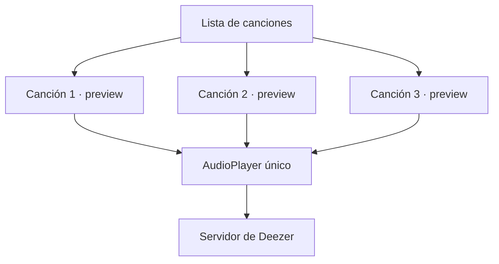

# Laboratorio 3: Reproducción de audio

<!-- tags: just_audio, AudioPlayer, reproducir preview de una canción,
     un solo reproductor para toda la lista, StreamBuilder, playerStateStream,
     dispose del AudioPlayer, se reproducen dos canciones al tiempo -->

Ya tienes el buscador del laboratorio mostrando canciones en una lista. Cada canción
que devuelve Deezer trae un campo `preview`: la URL de un mp3 de 30 segundos. Vamos a
usarlo para poner un botón de play/pause en cada elemento de la lista.

## Dependencia

```plain
dependencies:
  just_audio: ^0.10.5
```

```bash
flutter pub get
```

## El error más obvio: un reproductor por canción

Lo primero que se te ocurre es que cada `ListTile` tenga su propio `AudioPlayer`, ya
que así el estado de "¿estoy sonando?" queda pegado a esa canción. El problema es que
si tienes 20 resultados en la lista, estás creando 20 reproductores — y nada te
impide que dos de ellos suenen al mismo tiempo, porque son objetos completamente
independientes.

Lo correcto es al revés: **un solo `AudioPlayer` para toda la lista**, y cuando el
usuario toca "play" en otra canción, ese mismo reproductor cambia de URL.



Como solo hay un reproductor, solo puede sonar una canción a la vez — que es
exactamente lo que quieres.

## Encapsulando el reproductor

En vez de repartir el `AudioPlayer` por toda la pantalla, lo escondemos detrás de una
clase pequeña. Esa clase se acuerda de **qué URL está cargada ahora mismo**, para
poder decidir si tocar "play" en una canción significa cargarla desde cero o
simplemente pausar/reanudar la que ya está sonando.

```dart
import 'package:just_audio/just_audio.dart';

class PreviewPlayer {
  final AudioPlayer _player = AudioPlayer();

  String? _currentUrl;

  String? get currentUrl => _currentUrl;

  Stream<PlayerState> get playerStateStream => _player.playerStateStream;

  Future<void> toggle(String url) async {
    if (_currentUrl == url) {
      // Es la misma canción que ya estaba cargada: solo pausar o reanudar
      if (_player.playing) {
        await _player.pause();
      } else {
        await _player.play();
      }
      return;
    }

    // Es una canción distinta: hay que cargarla y arrancarla
    _currentUrl = url;
    await _player.setUrl(url);
    await _player.play();
  }

  Future<void> stop() async {
    await _player.stop();
    _currentUrl = null;
  }

  Future<void> dispose() async {
    await _player.dispose();
  }
}
```

`toggle` es el único método que vas a llamar desde la UI: no le importa si la canción
ya estaba sonando, estaba pausada o es una completamente nueva — decide sola qué
hacer.

## Un `PreviewPlayer` para toda la pantalla

Este reproductor lo crea el `State` que tiene la lista — el mismo que guarda los
resultados de la búsqueda — no cada `ListTile`. Se comporta igual que el
`TextEditingController` que ya usaste en labs anteriores: vive como campo del
`State` y se libera en `dispose()`.

```dart
class _SearchScreenState extends State<SearchScreen> {
  final PreviewPlayer _previewPlayer = PreviewPlayer();
  List<dynamic> _canciones = [];

  // ... aquí va la búsqueda que ya tienes del laboratorio

  @override
  void dispose() {
    _previewPlayer.dispose();
    super.dispose();
  }
}
```

Si no llamas `dispose()`, el reproductor y el stream que abre por debajo se quedan
vivos aunque el usuario ya haya salido de la pantalla.

## El botón de play/pause en cada canción

Como los resultados de Deezer todavía son un `Map<String, dynamic>` (el mismo que
armaste con `jsonDecode` en la lección de Utilidades), accedes a sus campos con
corchetes:

```dart
ListView.builder(
  itemCount: _canciones.length,
  itemBuilder: (context, index) {
    final cancion = _canciones[index];
    final previewUrl = cancion['preview'];

    return ListTile(
      title: Text(cancion['title']),
      subtitle: Text(cancion['artist']['name']),
      trailing: StreamBuilder<PlayerState>(
        stream: _previewPlayer.playerStateStream,
        builder: (context, snapshot) {
          final estaCargada = _previewPlayer.currentUrl == previewUrl;
          final estaSonando = estaCargada && (snapshot.data?.playing ?? false);

          return IconButton(
            icon: Icon(estaSonando ? Icons.pause : Icons.play_arrow),
            onPressed: () => _previewPlayer.toggle(previewUrl),
          );
        },
      ),
    );
  },
)
```

Fíjate en las dos condiciones antes de dibujar el ícono:

- **`estaCargada`** — la URL que tiene guardada el `PreviewPlayer` es justo la de
  *esta* canción. Sin este chequeo, todos los botones de la lista se pintarían como
  "pausa" apenas cualquier canción empezara a sonar.
- **`estaSonando`** — además de ser la canción cargada, el reproductor está
  efectivamente reproduciendo (no solo cargada y en pausa).

## Por qué `StreamBuilder` y no `setState`

El `AudioPlayer` cambia de estado por su cuenta — cuando el mp3 termina, cuando
termina de cargar, cuando hay un error de red — y esos cambios no pasan por tus
manos, así que no hay un lugar obvio donde llamar `setState`. `playerStateStream`
te avisa cada vez que algo cambia, y `StreamBuilder` reconstruye el `ListTile`
automáticamente cuando eso pasa. Es la misma idea de "escuchar un stream" que ya
viste antes, aplicada a la UI.
